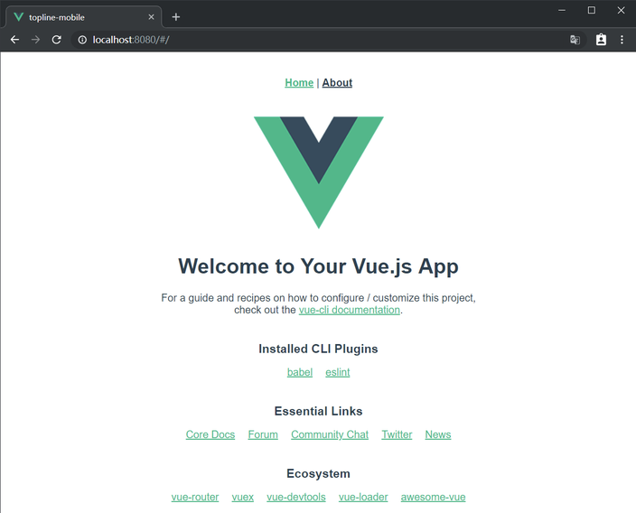
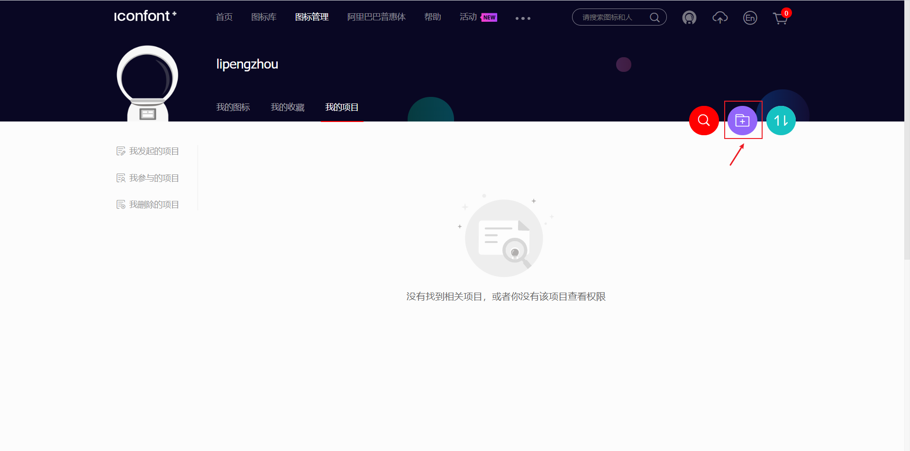
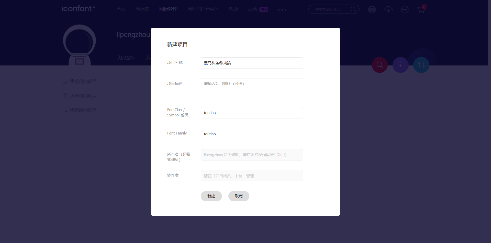
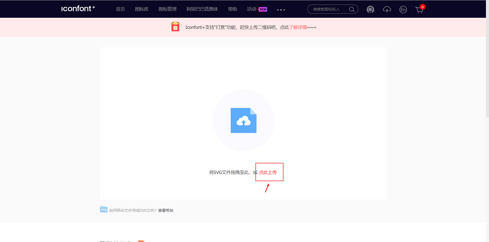
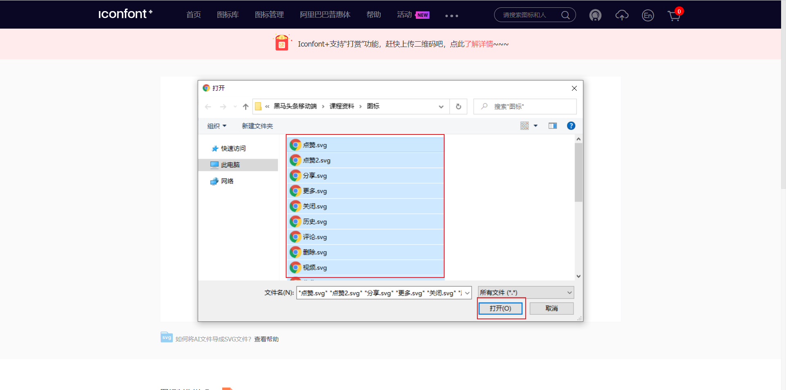
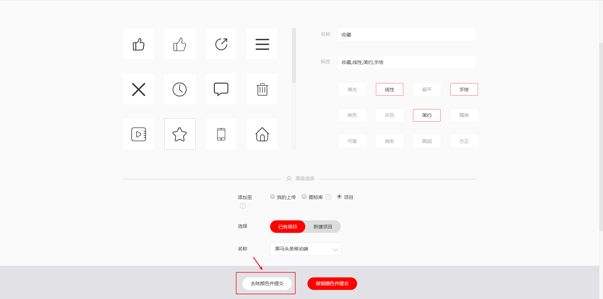
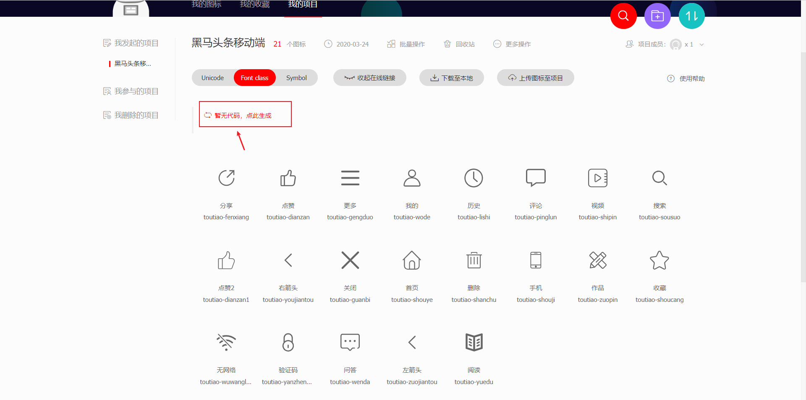
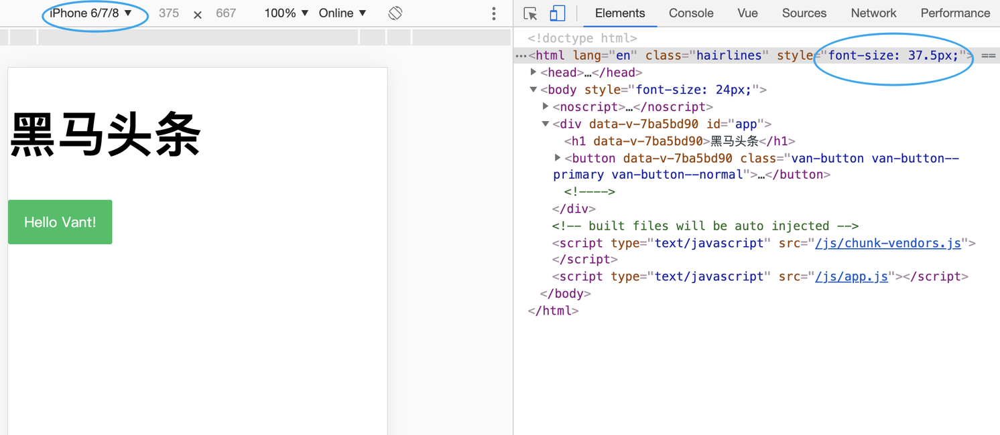

# 一、项目初始化

> 目标
> - 能使用 Vue CLI 创建项目
> - 了解 Vant 组件库的导入方式
> - 掌握制作使用字体图标的方式
> - 掌握如何在 Vue 项目中处理 REM 适配
> - 理解 axios 请求模块的封装

## 使用 Vue CLI 创建项目

> 如果你还没有安装 VueCLI，请执行下面的命令安装或是升级：
>
> ```sh
> npm install --global @vue/cli
> ```

在命令行中输入以下命令创建 Vue 项目：

```sh
vue create toutiao-m
```

```sh
Vue CLI v4.2.3
? Please pick a preset:
  default (babel, eslint)
> Manually select features
```
> default：默认勾选 babel、eslint，回车之后直接进入装包
>
> manually：自定义勾选特性配置，选择完毕之后，才会进入装包
>
> 选择第 2 种：手动选择特性，支持更多自定义选项


```shell
? Please pick a preset: Manually select features
? Check the features needed for your project:
 (*) Babel
 ( ) TypeScript
 ( ) Progressive Web App (PWA) Support
 (*) Router
 (*) Vuex
 (*) CSS Pre-processors
>(*) Linter / Formatter
 ( ) Unit Testing
 ( ) E2E Testing
```
> 分别选择：
> Babel：es6 转 es5
> Router：路由
> Vuex：数据容器，存储共享数据
> CSS Pre-processors：CSS 预处理器，后面会提示你选择 less、sass、stylus 等
> Linter / Formatter：代码格式校验


```shell
? Use history mode for router? (Requires proper server setup for index fallback in production) (Y/n) n
```
> 是否使用 history 路由模式，这里输入 n 不使用


```shell
? Pick a CSS pre-processor (PostCSS, Autoprefixer and CSS Modules are supported by default):
  Sass/SCSS (with dart-sass)
  Sass/SCSS (with node-sass)
> Less
  Stylus
```
> 选择 CSS 预处理器，这里选择我们熟悉的 Less


```shell
? Pick a linter / formatter config:
  ESLint with error prevention only
  ESLint + Airbnb config
> ESLint + Standard config
  ESLint + Prettier
```
> 选择校验工具，这里选择 ESLint + [Standard config](https://standardjs.com/)


```shell
? Pick additional lint features:
 (*) Lint on save
>(*) Lint and fix on commit
```
> 选择在什么时机下触发代码格式校验：
> - Lint on save：每当保存文件的时候
> - Lint and fix on commit：每当执行 `git commit` 提交的时候
> 
这里建议两个都选上，更严谨。


```shell
? Where do you prefer placing config for Babel, ESLint, etc.? (Use arrow keys)
> In dedicated config files
  In package.json
```
> Babel、ESLint 等工具会有一些额外的配置文件，这里的意思是问你将这些工具相关的配置文件写到哪里：
> - In dedicated config files：分别保存到单独的配置文件
> - In package.json：保存到 package.json 文件中
> 
这里建议选择第 1 个，保存到单独的配置文件，这样方便我们做自定义配置。


```shell
? Save this as a preset for future projects? (y/N) N
```
> 这里里是问你是否需要将刚才选择的一系列配置保存起来，然后它可以帮你记住上面的一系列选择，以便下次直接重用。

> 这里根据自己需要输入 y 或者 n，我这里输入 n 不需要。


```shell
✨  Creating project in C:\Users\LPZ\Desktop\topline-m-fe89\topline-m-89.
�  Initializing git repository...
⚙  Installing CLI plugins. This might take a while...

[          ........] - extract:object-keys: sill extract json5@2.1.1
```
> 向导配置结束，开始装包。
> 安装包的时间可能较长，请耐心等待......


```shell
⚓  Running completion hooks...

�  Generating README.md...

�  Successfully created project topline-m-89.
�  Get started with the following commands:

 $ cd topline-m
 $ npm run serve
```
安装结束，命令提示你项目创建成功，按照命令行的提示在终端中分别输入：

```shell
# 进入你的项目目录
cd toutiao-webapp

# 启动开发服务
npm run serve
```


```shell
 DONE  Compiled successfully in 7527ms


  App running at:
  - Local:   http://localhost:8080/
  - Network: http://192.168.10.216:8080/

  Note that the development build is not optimized.
  To create a production build, run npm run build.
```
> 启动成功，命令行中输出项目的 http 访问地址。
> 打开浏览器，输入其中任何一个地址进行访问。




如果能看到该页面，恭喜你，项目创建成功了。

## 加入 Git 版本管理

几个好处：

- 代码备份
- 多人协作
- 历史记录
- ...


（1）创建远程仓库

- [GitHub](https://github.com/lipengzhou)
- [码云](https://gitee.com/)
- [Coding](https://coding.net/)
- ...


（2）将本地仓库推到线上

如果没有本地仓库。

```shell
# 创建本地仓库
git init

# 将文件添加到暂存区
git add 文件

# 提交历史记录
git commit "提交日志"

# 添加远端仓库地址
git remote add origin 你的远程仓库地址

# 推送提交
git push -u origin master
```

如果已有本地仓库（Vue CLI 已经帮我们初始化好了）。

```shell
# 添加远端仓库地址
git remote add origin 你的远程仓库地址

# 推送提交
git push -u origin master /简写
git push --set-upstream origin master
```

如果之后项目代码有了变动需要提交：

```shell
git add
git commit
git push
```

## 调整初始目录结构

默认生成的目录结构不满足我们的开发需求，所以这里需要做一些自定义改动。

这里主要就是下面的两个工作：

- 删除初始化的默认文件
- 新增调整我们需要的目录结构

1、将 `App.vue` 修改为

```html
<template>
  <div id="app">
    <h1>黑马头条</h1>
    <router-view />
  </div>
</template>

<script>
export default {
  name: 'App'
}
</script>

<style scoped lang="less"></style>

```

2、将 `router/index.js` 修改为

```javascript
import Vue from 'vue'
import VueRouter from 'vue-router'

Vue.use(VueRouter)

const routes = [
]

const router = new VueRouter({
  routes
})

export default router

```

3、删除

- src/views/About.vue
- src/views/Home.vue
- src/components/HelloWorld.vue
- src/assets/logo.png

4、创建以下几个目录

- src/api 目录
  - 存储接口封装
- src/utils 目录
  - 存储一些工具模块
- src/styles 目录
  - index.less 文件，存储全局样式
  - 在 `main.js` 中加载全局样式 `import './styles/index.less'`

调整之后的目录结构如下。

```
.                                 
├── README.md                     
├── babel.config.js               
├── package-lock.json             
├── package.json                  
├── public                        
│   ├── favicon.ico               
│   └── index.html                
└── src                           
    ├── api
    ├── App.vue                   
    ├── assets                    
    ├── components                
    ├── main.js                   
    ├── router
    ├── utils
    ├── styles
    ├── store                     
    └── views
```


## 导入图标素材

设计师为我们单独提供了设计稿中的图标，为了方便使用，我们在这里把它制作为字体图标。

制作字体图标的工具有很多，在这里我们推荐大家使用：https://www.iconfont.cn/。

一、注册账户


> 直接选择第三方登录即可


二、创建项目







三、上传图标到项目









四、生成链接




五、配置到项目中使用

一种方式是[将 SVG 图标 包装为 Vue 组件来使用](https://cn.vuejs.org/v2/cookbook/editable-svg-icons.html)。

一种方式是将 SVG 制作为字体图标来使用：

## 引入 Vant 组件库


Vant 是有赞商城前端开发团队开发的一个基于 Vue.js 的移动端组件库，它提供了非常丰富的移动端功能组件，简单易用。

- [官方文档](https://youzan.github.io/vant/#/zh-CN/)
- [GitHub 仓库](https://github.com/youzan/vant)

下面是在 Vant 官网中列出的一些优点：

- 60+ 高质量组件
- 90% 单元测试覆盖率
- 完善的中英文文档和示例
- 支持按需引入
- 支持主题定制
- 支持国际化
- 支持 TS
- 支持 SSR

在我们的项目中主要使用 Vant 作为核心组件库，下面我们根据[官方文档](https://youzan.github.io/vant/#/zh-CN/quickstart#yin-ru-zu-jian)将 Vant 导入项目中。

将 Vant 引入项目一共有四种方式：

- 方式一：自动按需引入组件
  - 和方式二一样，都是按需引入，但是加载更方便一些（需要额外配置插件）
  - 优点：打包体积小
  - 缺点：每个组件在使用之前都需要手动加载注册

- 方式二：手动按需引入组件
  - 在不使用插件的情况下，可以手动引入需要的组件
  - 优点：打包体积小
  - 缺点：每个组件在使用之前都需要手动加载注册

- 方式三：导入所有组件
  - Vant 支持一次性导入所有组件，引入所有组件会增加代码包体积，因此不推荐这种做法
  - 优点：导入一次，使用所有
  - 缺点：打包体积大

- 方式四：通过 CDN 引入
  - 使用 Vant 最简单的方法是直接在 html 文件中引入 CDN 链接，之后你可以通过全局变量`vant`访问到所有组件。
  - 优点：适合一些演示、示例项目，一个 html 文件就可以跑起来
  - 缺点：不适合在模块化系统中使用

这里建议为了前期开发的便利性我们选择方式三：导入所有组件，在最后做打包优化的时候根据需求配置按需加载以降低打包体积大小。

1、安装 Vant

```shell
npm i vant
```

2、在 `main.js` 中加载注册 Vant 组件

```javascript
import Vue from 'vue'
import Vant from 'vant'
import 'vant/lib/index.css'

Vue.use(Vant)
```

3、查阅文档使用组件


> Vant 的文档非常清晰，左侧是组件目录导航，中间是效果代码，右边是效果预览。


例如我们在根组件使用 Vant 中的组件：

```html
<van-button type="default">默认按钮</van-button>
<van-button type="primary">主要按钮</van-button>
<van-button type="info">信息按钮</van-button>
<van-button type="warning">警告按钮</van-button>
<van-button type="danger">危险按钮</van-button>

<van-cell-group>
  <van-cell title="单元格" value="内容" />
  <van-cell title="单元格" value="内容" label="描述信息" />
</van-cell-group>
```


> 如果在页面中能够正常的看到下面的效果，则说明 Vant 导入成功了。


## 移动端 REM 适配

Vant 中的样式默认使用 `px` 作为单位，如果需要使用 `rem` 单位，推荐使用以下两个工具：

- [postcss-pxtorem](https://github.com/cuth/postcss-pxtorem) 是一款 postcss 插件，用于将单位转化为 rem
- [lib-flexible](https://github.com/amfe/lib-flexible) 用于设置 rem 基准值

下面我们分别将这两个工具配置到项目中完成 REM 适配。

**一、使用 [lib-flexible](https://github.com/amfe/lib-flexible) 动态设置 REM 基准值（html 标签的字体大小）**

1、安装

```shell
# yarn add amfe-flexible
npm i amfe-flexible
```

2、然后在 `main.js` 中加载执行该模块

```javascript
import 'amfe-flexible'
```

最后测试：在浏览器中切换不同的手机设备尺寸，观察 html 标签 `font-size` 的变化。


> 例如在 iPhone 6/7/8 设备下，html 标签字体大小为 37.5 px


> 例如在 iPhone 6/7/8 Plus 设备下，html 标签字体大小为 41.4 px


**二、使用 [postcss-pxtorem](https://github.com/cuth/postcss-pxtorem) 将 `px` 转为 `rem`**

1、安装

```shell
# yarn add -D postcss-pxtorem
# -D 是 --save-dev 的简写
npm install postcss-pxtorem -D
```

2、然后在**项目根目录**中创建 `.postcssrc.js` 文件

```javascript
module.exports = {
  plugins: {
    'autoprefixer': {
      browsers: ['Android >= 4.0', 'iOS >= 8']
    },
    'postcss-pxtorem': {
      rootValue: 37.5,
      propList: ['*']
    }
  }
}

```

3、**配置完毕，重新启动服务**

最后测试：**刷新浏览器页面**，审查元素的样式查看是否已将 `px` 转换为 `rem`。


> 这是没有配置转换之前的。


> 这是转换之后的，可以看到 px 都被转换为了 rem。


**需要注意的是：**

- 该插件**不能转换行内样式中的 `px`**，例如 `<div style="width: 200px;"></div>`

## 关于 `.postcssrc.js` 配置文件

```js
module.exports = {
  plugins: {
    'autoprefixer': {
      browsers: ['Android >= 4.0', 'iOS >= 8']
    },
    'postcss-pxtorem': {
      rootValue: 37.5,
      propList: ['*']
    }
  }
}

```

`.postcssrc.js` 是 PostCSS 的配置文件。


（1）PostCSS 介绍

[PostCSS](https://postcss.org/) 是一个处理 CSS 的处理工具，本身功能比较单一，它主要负责解析 CSS 代码，再交由插件来进行处理，它的插件体系非常强大，所能进行的操作是多种多样的，例如：

- [Autoprefixer](https://github.com/postcss/autoprefixer) 插件可以实现自动添加浏览器相关的声明前缀
- [PostCSS Preset Env](https://github.com/csstools/postcss-preset-env) 插件可以让你使用更新的 CSS 语法特性并实现向下兼容
- [postcss-pxtorem](https://github.com/cuth/postcss-pxtorem) 可以实现将 px 转换为 rem
- ...

目前 PostCSS 已经有 [200 多个功能各异的插件](https://github.com/postcss/postcss/blob/master/docs/plugins.md)。开发人员也可以根据项目的需要，开发出自己的 PostCSS 插件。


PostCSS 一般不单独使用，而是与已有的构建工具进行集成。

[Vue CLI 默认集成了 PostCSS](https://cli.vuejs.org/zh/guide/css.html#postcss)，并且默认开启了 [autoprefixer](https://github.com/postcss/autoprefixer) 插件。

> Vue CLI 内部使用了 PostCSS。
>
> 你可以通过 `.postcssrc` 或任何 [postcss-load-config](https://github.com/michael-ciniawsky/postcss-load-config) 支持的配置源来配置 PostCSS。也可以通过 `vue.config.js` 中的 `css.loaderOptions.postcss` 配置 [postcss-loader](https://github.com/postcss/postcss-loader)。
>
> 我们默认开启了 [autoprefixer](https://github.com/postcss/autoprefixer)。如果要配置目标浏览器，可使用 `package.json` 的 [browserslist](https://cli.vuejs.org/zh/guide/browser-compatibility.html#browserslist) 字段。

（2）Autoprefixer 插件的配置


[autoprefixer](https://github.com/postcss/autoprefixer) 是一个自动添加浏览器前缀的 PostCss 插件，`browsers` 用来配置兼容的浏览器版本信息，但是写在这里的话会引起编译器警告。

```
Replace Autoprefixer browsers option to Browserslist config.
Use browserslist key in package.json or .browserslistrc file.

Using browsers option can cause errors. Browserslist config
can be used for Babel, Autoprefixer, postcss-normalize and other tools.

If you really need to use option, rename it to overrideBrowserslist.

Learn more at:
https://github.com/browserslist/browserslist#readme
https://twitter.com/browserslist
```

警告意思就是说你应该将 `browsers` 选项写到 `package.json` 或 `.browserlistrc` 文件中。

```
[Android]
>= 4.0

[iOS]
>= 8

```

> 具体语法请[参考这里](https://github.com/browserslist/browserslist)。

（3）postcss-pxtorem 插件的配置


- `rootValue`：表示根元素字体大小，它会根据根元素大小进行单位转换
- `propList` 用来设定可以从 px 转为 rem 的属性
  - 例如 `*` 就是所有属性都要转换，`width` 就是仅转换 `width` 属性


`rootValue` 应该如何设置呢？

```
如果你使用的是基于 lib-flexable 的 REM 适配方案，则应该设置为你的设计稿的十分之一。
例如设计稿是 750 宽，则应该设置为 75。
```


大多数设计稿的原型都是以 iphone6 为原型，iphone6 设备的宽是 750，我们的设计稿也是这样。

但是 Vant 建议设置为 37.5，为什么呢？

```
因为 Vant 是基于 375 写的，所以如果你设置为 75 的话，Vant 的样式就小了一半。
```

所以如果设置为 `37.5` 的话，Vant 的样式是没有问题的，但是我们在测量设计稿的时候都必须除2才能使用，否则就会变得很大。


这样做其实也没有问题，但是有没有更好的办法呢？我就想实现测量多少写多少（不用换算）。于是聪明的你就想，可以不可以这样来做？

- 如果是 Vant 的样式，就把 `rootValue` 设置为 37.5 来转换
- 如果是我们的样式，就按照 75 的 `rootValue` 来转换


通过[查阅文档](https://github.com/cuth/postcss-pxtorem#options)我们可以看到 `rootValue` 支持两种参数类型：

- 数字：固定值
- 函数：动态计算返回
  - postcss-pxtorem 处理每个 CSS 文件的时候都会来调用这个函数
  - 它会把被处理的 CSS 文件相关的信息通过参数传递给该函数

所以我们修改配置如下：

```js
/**
 * PostCSS 配置文件
 */

module.exports = {
  // 配置要使用的 PostCSS 插件
  plugins: {
    // 配置使用 autoprefixer 插件
    // 作用：生成浏览器 CSS 样式规则前缀
    // VueCLI 内部已经配置了 autoprefixer 插件
    // 所以又配置了一次，所以产生冲突了
    // 'autoprefixer': { // autoprefixer 插件的配置
    //   // 配置要兼容到的环境信息
    //   browsers: ['Android >= 4.0', 'iOS >= 8']
    // },

    // 配置使用 postcss-pxtorem 插件
    // 作用：把 px 转为 rem
    'postcss-pxtorem': {
      rootValue ({ file }) {
        return file.indexOf('vant') !== -1 ? 37.5 : 75
      },
      propList: ['*']
    }
  }
}

```

配置完毕，把服务重启一下，最后测试，very good。


## 封装请求模块

和之前项目一样，这里我们还是使用 [axios](https://github.com/axios/axios) 作为我们项目中的请求库，为了方便使用，我们把它封装为一个请求模块，在需要的时候直接加载即可。

1、安装 axios

```shell
npm i axios
```

2、创建 `src/utils/request.js`

```javascript
/**
 * 封装 axios 请求模块
 */
import axios from "axios"

const request = axios.create({
  baseURL: "http://ttapi.research.itcast.cn/" // 基础路径
})

export default request
```

3、如何使用

- 方式一（简单方便，但是不利于接口维护）：我们可以把请求对象挂载到 `Vue.prototype` 原型对象中，然后在组件中通过 `this.xxx` 直接访问
- 方式二（推荐）：我们把每一个请求都封装成每个独立的功能函数，在需要的时候加载调用，这种做法更便于接口的管理和维护

在我们的项目中建议使用方式二，更推荐（在随后的业务功能中我们就能学到）。


